<h1>🚗🚙 Spring Final Project 타:이거 🚐🚕</h1>
<br>

## 🌳 Portfolio [[click!](https://github.com/bottleCow/Final-Project/ReadmePictures/portfolio.pdf)] 🌳 
<br>

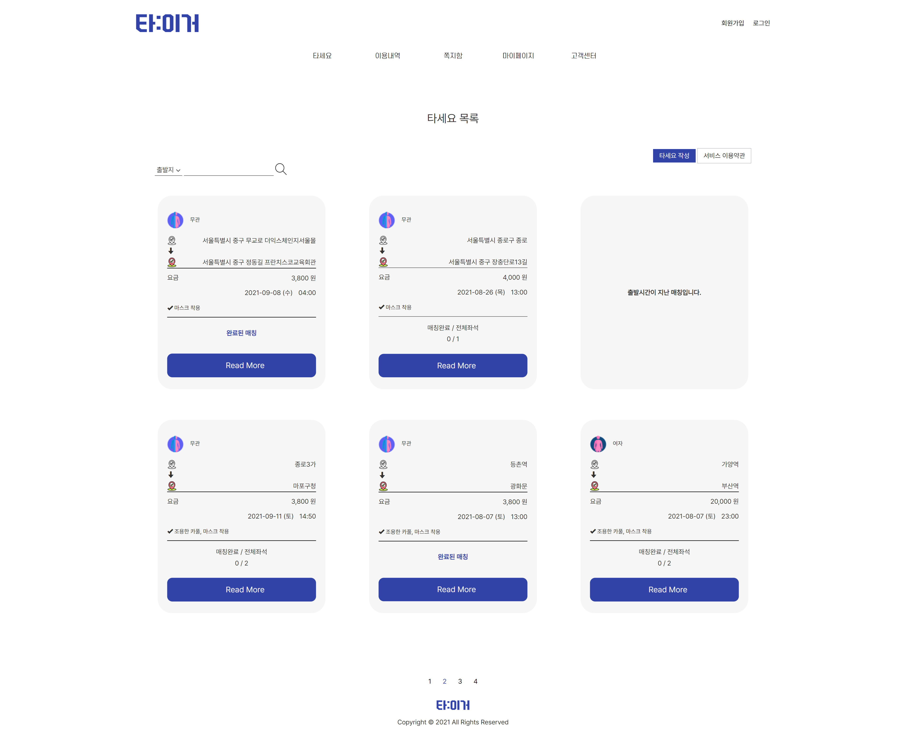
<br>

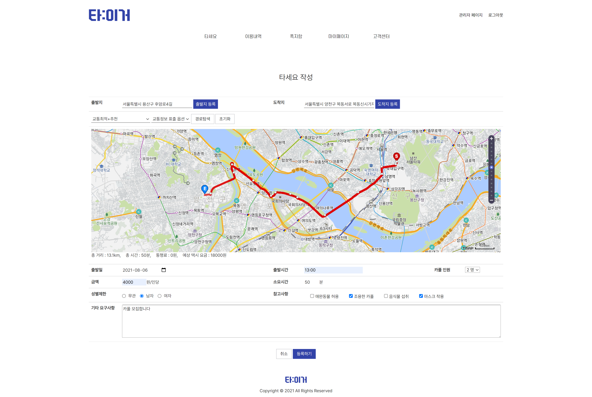
<br>

## ⭐️ Overview ⭐️
- 목적지나 방향이 같은 운전자 회원과 탑승자 회원의 카풀을 위한 매칭 서비스<br>
드라이버와 탑승자를 매칭시켜주는 라이드 쉐어링 서비스
- 드라이버 : 차량유지비 및 차량 운행비용 절감
- 탑승자 : 택시보다 저렴한 금액으로 차량 이용 가능
<br>

## 🕑 프로젝트 개발 기간 🕑
- 2021년 7월 2일 ~ 2021년 8월 4일
<br>

## 🧙‍♂️ 업무분담 🧙‍♂️ (5명)
- 🧑강병우<br>
             타세요(카풀매칭) 페이지 목록 : 키워드 검색, 조회, 페이징 및 기타 UI 작업<br>
             타세요 작성 페이지 : 등록<br>
             타세요 상세 페이지 : 조회, 드라이버/탑승자 신고<br>
             1) 드라이버 신청현황 : 신청, 수락/거절, 매칭 완료 시 남은 신청 건 자동 거절 기능<br>
             매칭 완료 시 글 수정/삭제 방지<br>
             2) 탑승자 신청현황 : 신청, 신청 취소, 중복 신청 방지, 매칭 상태 안내<br>
            
- 👩김나연<br>
             메인페이지 : UI 작업<br>
             공지사항 : 목록, 상세 페이지<br>
             1:1 문의하기 등록 및 삭제<br>
             문의내역 : 조회, 검색, 페이징<br>
             쪽지함 : 작성, 받은 쪽지함, 보낸 쪽지함, 삭제<br>
             
- 🧑김동윤<br>
             관리자 공지사항 : 조회, 작성, 검색, 페이징 <br>
             드라이버 승인 : 승인, 반려 처리<br>
             관리자 문의 내역 : 조회, 답글 작성<br>
             관리자 회원 관리 : 회원 정보, 수정, 탈퇴/복구<br>
             관리자 신고 관리 : 신고 게시글 수정/삭제<br>
             카풀 서비스 : 주소검색, 경로탐색 (TMAP API)<br>
             타세요 작성 페이지 : 등록<br>
             타세요 상세 페이지 : 조회, 신고<br>
             
- 👩서혜원<br>
             회원관리 페이지<br>
             마이페이지 : 회원정보 수정, 탈퇴, 비밀번호 변경<br>
             회원 프로필 : 프로필 상세 페이지<br>
             
- 🧑윤준호<br>
             회원관리 : 로그인, 회원가입, 아이디찾기, 비밀번호 찾기<br>
             마이페이지 : 정보 수정, 비밀번호 변경, 좋아요 관리<br>
             프로필 : 프로필 상세 조회, 후기 및 평점 조회<br>
             차량관리 : 드라이버 신청, 차량등록 및 삭제<br>
 <br>
 
## 💻 개발환경 활용도구 및 기술 💻<br>
- 운영체제             - MS Window 10 Pro, MacOS<br>
- 통합개발환경         - Spring Tool Suite 3.9.12 RELEASE<br>
- 개발 언어            - Java/JSP, JavaScript/JQuery, HTML5/CSS3<br>
- 데이터베이스 설계    - DA# Modeler<br>
- 데이터베이스         - Oracle 11g xe<br>
- 웹 어플리케이션 서버 - Apache Tomcat v 9.0<br>
- 웹 프레임워크        - MyBatis, Tiles, Bootstrap<br>
<br>

## Database ERD
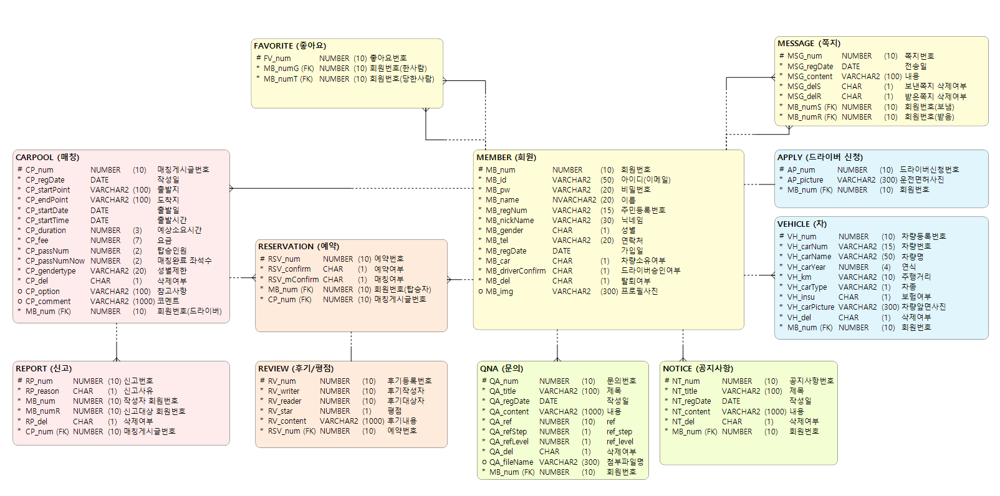
<br>
## 메인 페이지
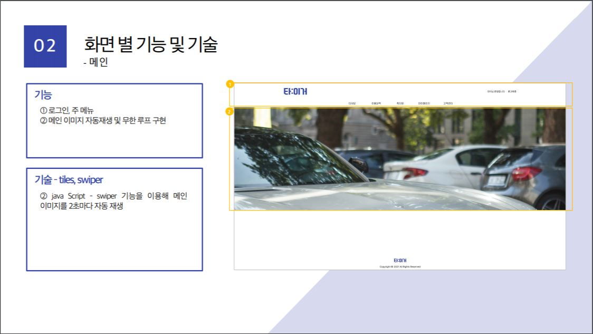
<br>
## 회원가입
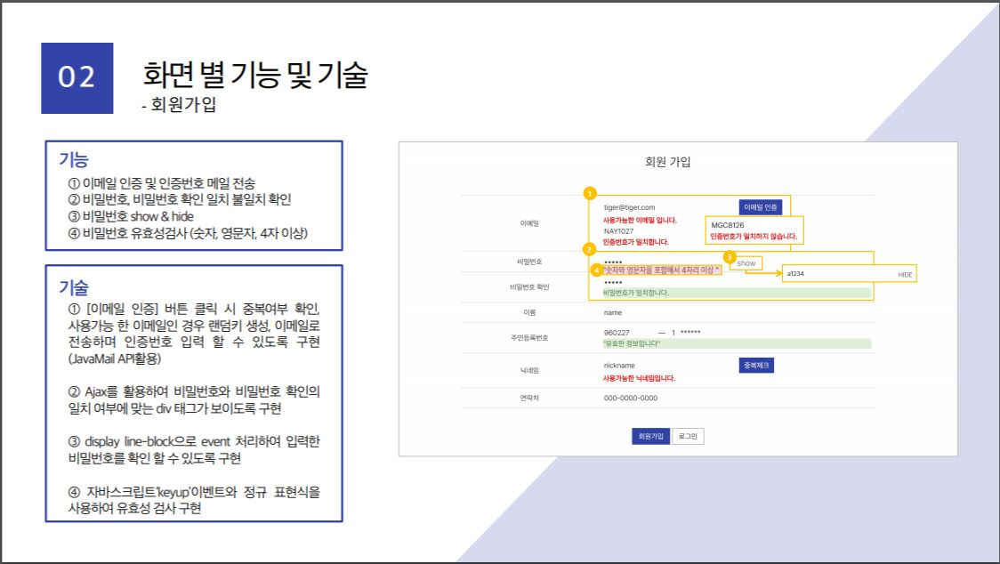
<br>
## 프로필 변경
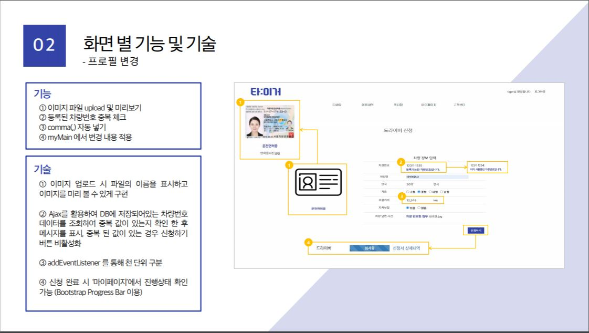
<br>
## 매칭 게시글 작성
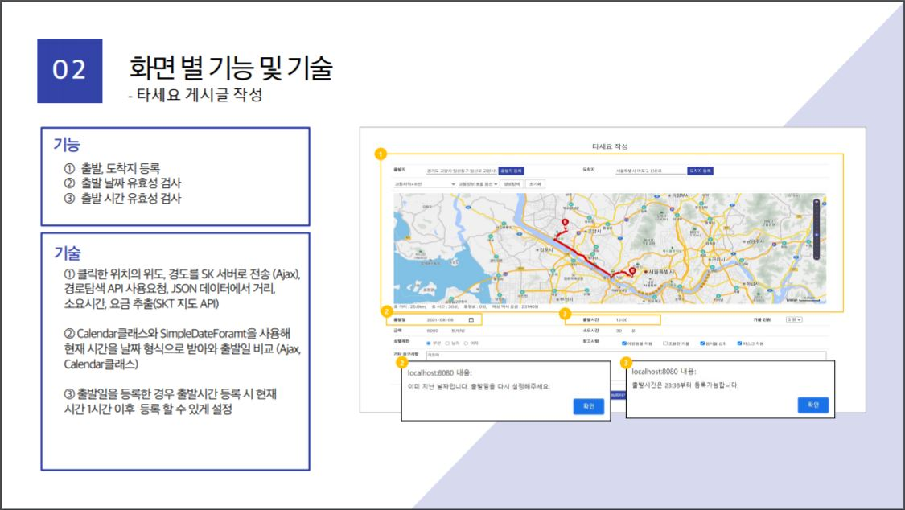
<br>
## 매칭 상세페이지(드라이버 로그인)
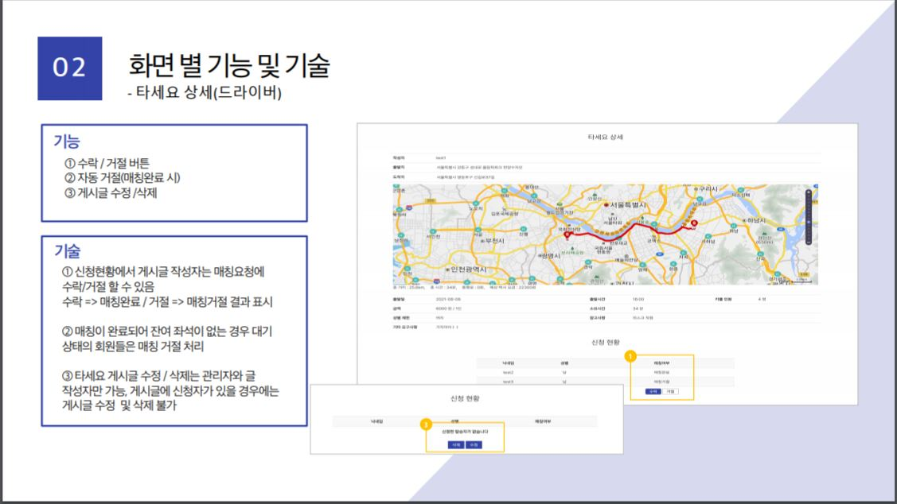
<br>
## 매칭 상세페이지(탑승자 로그인)
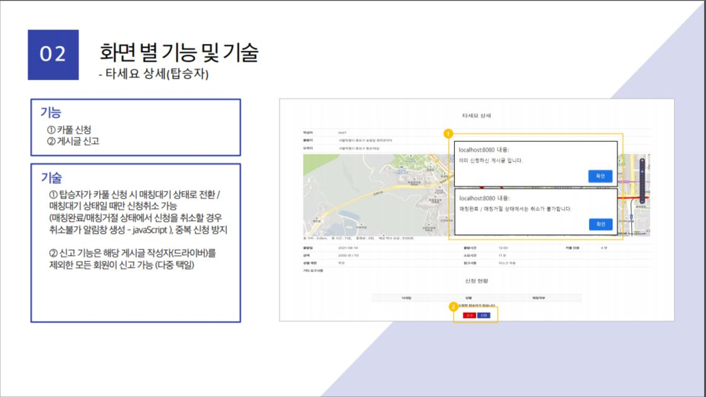
<br>
## 후기
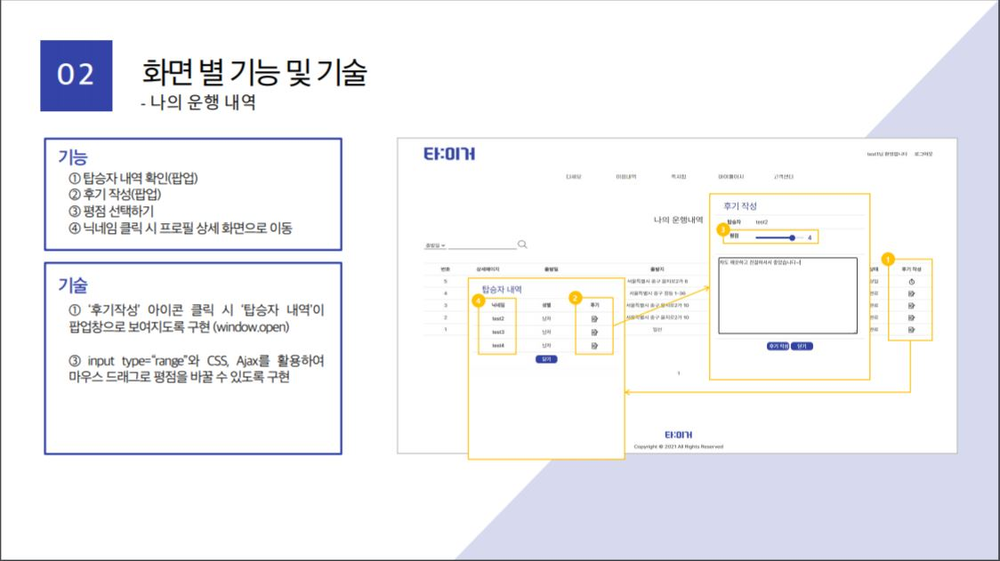
<br>
## 쪽지 / 좋아요
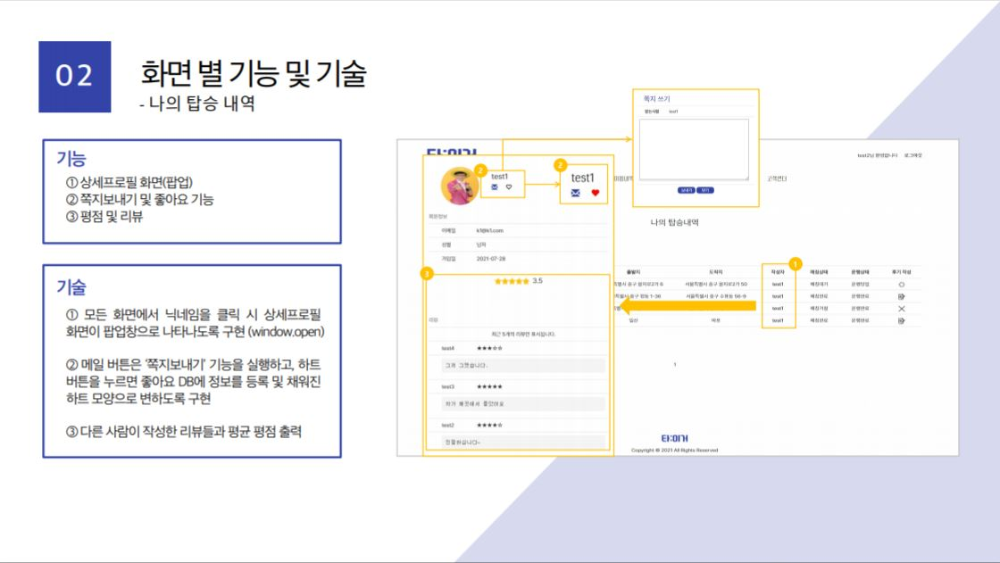
<br>
## 관리자 페이지
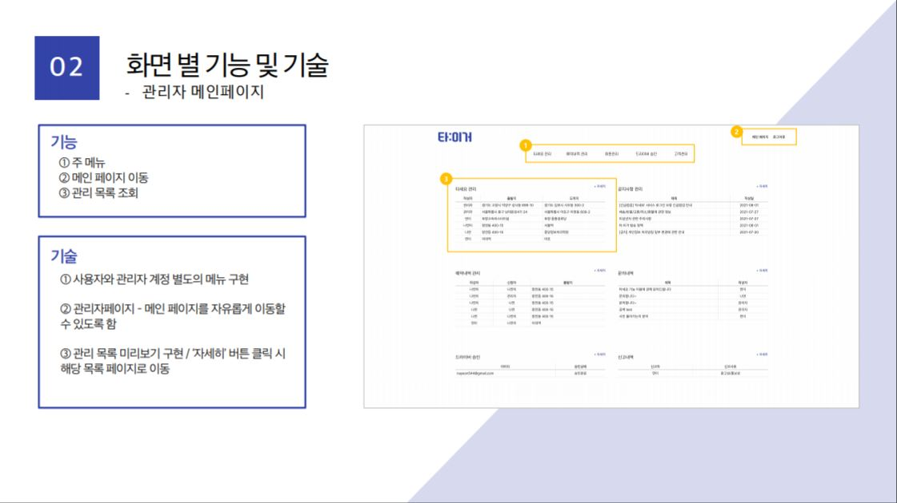
<br>
 ```
    git clone {저장소URL}
    ```
```bash
git commit -m 'initial project'
git push - u origin master
```
## Documentation 📑

튜토리얼 문서는 [웹 포트폴리오 제작 튜토리얼](https://www.notion.so/cucus/85e3bec77d904f1fa282cec4756232c3)에서 확인해주세요.

## Deploy History 🌳

2021-04-22

- 전체 레이아웃 수정
- header 사진 변경

2021-04-20

- 프로젝트 생성
